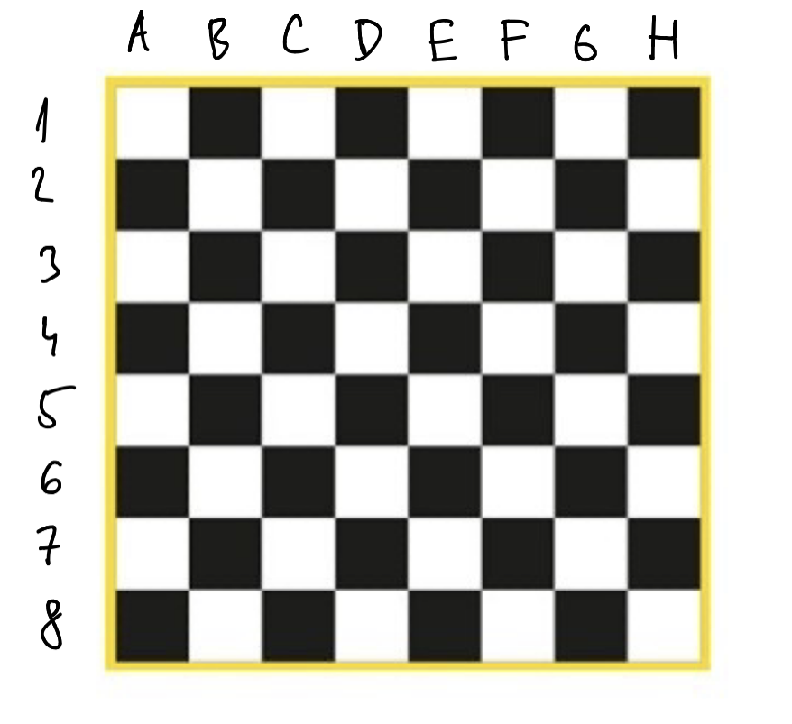

# Cvičení: vytvoření šachovnice

Úloha, kterou budeme během semestru postupně rozšiřovat.
Zatím načteme část vstupu (bez ověřování) a zaplníme šachovnici.

1. Připravte šachovnici, 8x8, kde každé políčko obsahuje číslo. Políčka inicializujte na 0.
2. Do šachovnice budeme umisťovat figurky, zadávají se na vstupu. Vstup pro jednu figurku je vždy zadán na řádku po dvou položkách:
```
3A 0120
```
kde `3A` představuje souřadnici, oddělenou mezerou od čísla,
jehož význam můžeme zatím ignorovat, nebude nikdy 0, jen ho uložte na odpovídající souřadnici do šachovnice!

Vstup je zakončen řádkem, který obsahuje pouze `-1`.



Jediné, co se může stát špatně, je znovuzaplnění pozice. Pokud na šachovnici už figurka je (zadaná na předchozím vstupu), program skončí a vypíše (pro příklad):
`Position already occupied: 3A`, pokud se už pozice `3A` jednou na vstupu vyskytla.

Pokud je všechen vstup zadán správně, na konci programu vypište číselné souřadnice šachovnice ([0,0] v levém horním rohu odpovídá `3A`) a jejich číselnou hodnotu (není nutné dodržet nějaký přesný formát).