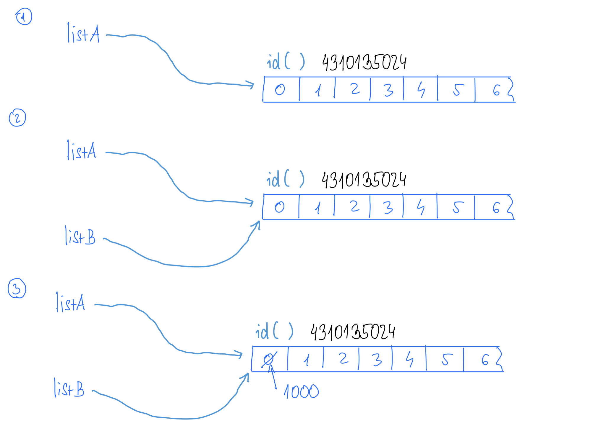
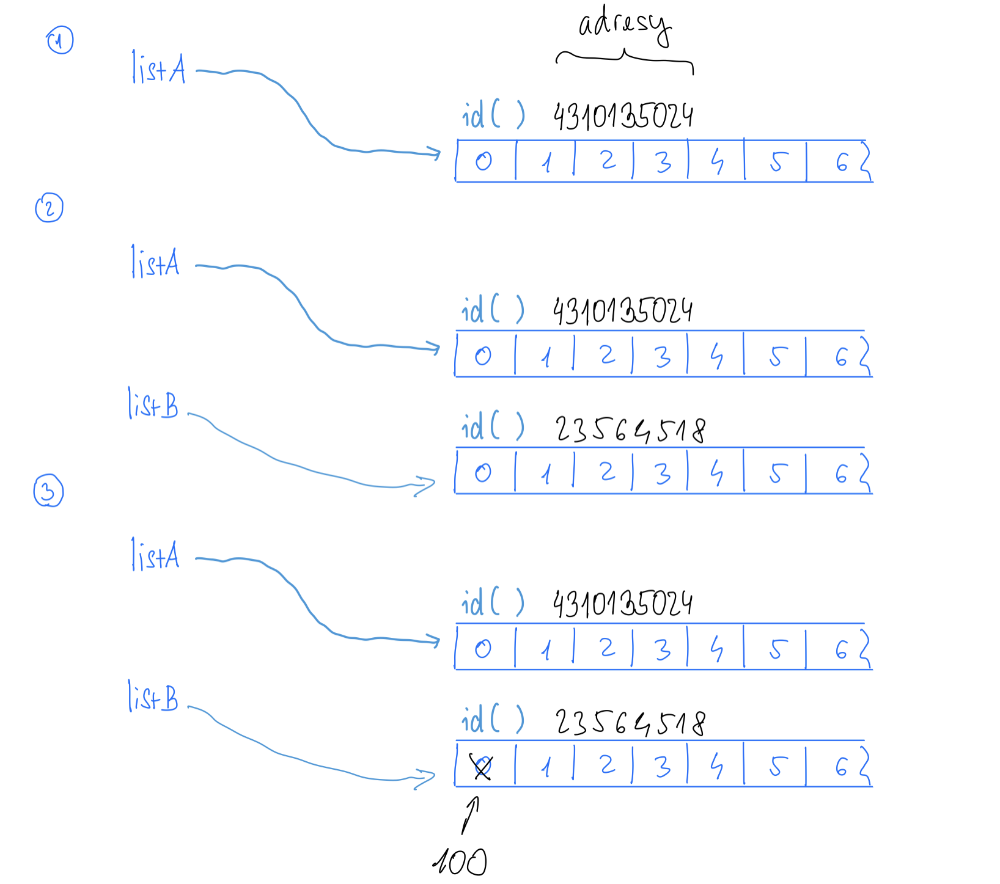

# Objekty

Zásadní je pochopit:
* rozdíl mezi tím, co je hodnota a odkaz (reference)
* rozdíl mezi `==` a `is`

# Reference

Známe z přednášky:

```python
listA = list(range(10)) # step 1
listB = listA           # step 2
listB[0] = 100          # step 3: and now we change list[A] also

print(listA)            # [100, 1, 2, 3, 4, 5, 6, 7, 8, 9]
print(listB)            # [100, 1, 2, 3, 4, 5, 6, 7, 8, 9]

print(listA == listB)   # True
print(listA is listB)   # True
```

můžeme si představit, že list `[100, 1, 2, 3, 4, 5, 6, 7, 8, 9]` na nějakém místě v paměti (adresa)
a reference je v `listA`, v `listB` reprezentovaná jako jen jako číslo, ta adresa listu v paměti:



## Kopie

Když chci změnit jenom `listB`, potřebuju vytvořit kopii (z přednášky):

```python
listA = list(range(10)) # step 1
listB = listA[:]        # step 2

print(listA == listB)   # True
print(listA is listB)   # False

listB[0] = 100          # step 3: and now we change list[A] also

print(listA)            # [0, 1, 2, 3, 4, 5, 6, 7, 8, 9]
print(listB)            # [100, 1, 2, 3, 4, 5, 6, 7, 8, 9]

print(listA == listB)   # False
print(listA is listB)   # False
```



Vedle slicing operátoru `[:]` je možné vytvořit kopii pomocí `copy()` -- podporují všechny struktury, třeba dictionary:

```python
WS19 = { 'NPRG060': 'Algoritmizace', 'NPRG030': 'Programovani I' }
WS20 = WS19.copy()

print(listA == listB)   # True
print(listA is listB)   # False
```


## Shallow copies

Co když vytvářím kopie listu (nebo jiných struktur), které obsahuje jako prvky reference:

```python
>>> inner_list = [1, 2, 3]
>>> outer_list = 3 * [inner_list]
outer_list
[[1, 2, 3], [1, 2, 3], [1, 2, 3]]
>>> inner_list.append(10)
>>> outer_list
[[1, 2, 3, 10], [1, 2, 3, 10], [1, 2, 3, 10]]
```

Obecně se tomuto chování říká vytváření `shallow copy`.
Samotné prvky v listu se nekopírují, reference zůstavají stejné.

Pokud se při kopírování struktury mají kopírovat i její prvky,
toto chování se označuje jako `deep copy`.


## !Pro zajímavost! s sys.intern a tabulka stringů

Někoho by mohlo zajímat, proč se tohle chová různě:

```python
list_a = [1, 2, 3, 5]
list_b = [1, 2, 3, 5]

print(list_a is list_b)         # False

string_a = 'abcd'
string_b = 'abcd'

print(string_a is string_b)     # True
```
[Tady](https://stackoverflow.com/questions/13650293/understanding-pythons-is-operator) vysvětleno celkem pěkně.